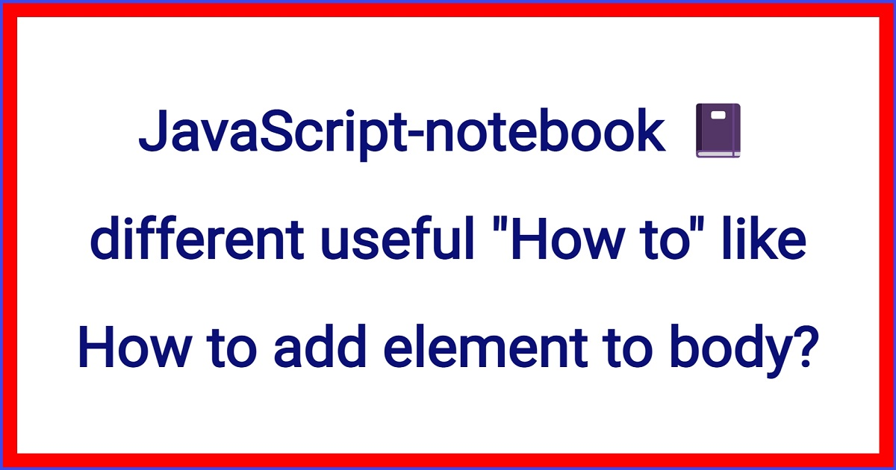

<!--  -->

# Javascript notebook.

## Useful Javascript cheat sheet if you are learning JavaScript from scratch.

### JavaScript-notebook :notebook: , different useful "How to", like "How to deploy a piece of code as text on site", "How to add element to body or DOM document's element using JavaScript", and others.

### How to deploy a piece of code as text on site:

###### See the deployed project [on Github pages](https://hacking-nassa-with-html.github.io/javascript-notebook)

### How to add element to body or DOM document's element using JavaScript:

Syntax: Element.insertAdjacentHTML() 

```js
insertAdjacentHTML(position, text)
```

example: main.js 93

```js
document.body.insertAdjacentHTML("afterend", mainPageContent())
```

more information [on MDN pages](https://developer.mozilla.org/en-US/docs/Web/API/Element/insertAdjacentHTML)

and [on Stack Overflow pages](https://stackoverflow.com/questions/15741006/adding-div-element-to-body-or-document-in-javascript)


### How to Convert a function to an arrow function:

function declaration .map() syntax:

```js
const upperizedNames = ['Farrin', 'Kagure', 'Asser'].map(function(name) { 
  return name.toUpperCase()
})
```

and arrow function .map() syntax:

```js
const upperizedNames = ['Farrin', 'Kagure', 'Asser'].map(
  name => name.toUpperCase()
)
console.log(upperizedNames)
```

one more example of arrow .map()

```js
const squares = [1, 2, 3, 4, 5, 6, 7, 8, 9, 10].map(
    square => square * square
)

console.log(...squares)  // works without ... too. Why?
```

---

function declaration .filter() syntax:

```js
const names = ['Afghanistan', 'Aruba', 'Bahamas', 'Chile', 'Fiji', 'Gabon', 'Luxembourg', 'Nepal', 'Singapore', 'Uganda', 'Zimbabwe']

const longNames = names.filter(function (name) {
    return name.length > 6
})

console.log(longNames)
```

and arrow function .filter() syntax:

```js
const names = ['Afghanistan', 'Aruba', 'Bahamas', 'Chile', 'Fiji', 'Gabon', 'Luxembourg', 'Nepal', 'Singapore', 'Uganda', 'Zimbabwe']

const longNamesArrow = names.filter(name => name.length > 6)
```

### Keyword THIS:

With regular functions, the value of This is set based on HOW the function is called. 

With arrow functions, the value of This is based on the function's surrounding 

context. 

In other words, the value of This inside an arrow function is the same as the 

value of This outside the function.

### How THIS works in a standard function:

1. A new object:

```js
const mySuperObject = new SuperObject('prop1', ['prop2']) 
```

The value of THIS inside the SuperObject constructor function is a new object because 

it was called with `new` keyword.

2. A specified object with call/apply:

```js
const sum = object1.doSomething.call(object2)
```

The value of THIS inside `doSomething()` will refer to `object2` since the first 

parameter of `call()` is to explicitly set what THIS refers to.

3. A context object:

If the function is a method of an object:

```js
object.coolMethod()
```

In the code above, the value of THIS inside `coolMethod()` will refer to `object`.

4. The global object or undefined:

If the function is called with no context:

```js
coolMethod()
```

In the code above, the value of THIS inside `coolMethod()` is either the global object 

or, if in strict mode, it's `undefined`.

more information on [You-Dont-Know-JS](https://github.com/getify/You-Dont-Know-JS/blob/1st-ed/this%20&%20object%20prototypes/README.md#you-dont-know-js-this--object-prototypes)

and on [You-Dont-Know-JS](https://github.com/getify/You-Dont-Know-JS/blob/master/README.md)

also information on [MDN](https://developer.mozilla.org/en-US/docs/Web/JavaScript/Reference/Operators/this)

and on [Stack Overflow](https://stackoverflow.com/questions/20279484/how-to-access-the-correct-this-inside-a-callback)

### Default function parameters:

```js
function hello(name = 'Visitor', greeting = 'Welcome') {
  return `${greeting} ${name}!`
}

console.log(hello()) // Welcome Visitor!
console.log(hello('Nikky')) // Welcome Nikky!
console.log(hello('Jennifer', 'Howdy')) // Howdy Jennifer!
```

### ES6 Classes syntax:

```js
class Plane {
  constructor(numEngines) {
    this.numEngines = numEngines
    this.enginesActive = false
  }

  startEngines() {
    console.log('starting engines…')
    this.enginesActive = true
  }
}

var richardsPlane = new Plane(1)
richardsPlane.startEngines()

var jamesPlane = new Plane(4)
jamesPlane.startEngines()
```

"Old" ES5 "Class" syntax: [Click Me](https://github.com/Hacking-NASSA-with-HTML/javascript-notebook/blob/main/assets/es5_class_syntax.md)

Subclasses:

Big example of the "Old" ES5 subclasses' syntax and "New" ES6 subclasses' syntax: [Click Me](https://github.com/Hacking-NASSA-with-HTML/javascript-notebook/blob/main/assets/big_exmpl_es5_and_es6_subclasses.md)

With Static method:

```js
class Plane {
  constructor(numEngines) {
    this.numEngines = numEngines
    this.enginesActive = false
  }

  static badWeather(planes) {
    for (plane of planes) {
      plane.enginesActive = false
    }
  }

  startEngines() {
    console.log('starting engines…')
    this.enginesActive = true
  }
}
```

and we can use it like

```js
Plane.badWeather([plane1, plane2])
```

directly on `Plane` class.


### The most 'cool' for loop:

```js
const digits = [0, 1, 2, 3, 4, 5, 6, 7, 8, 9];

for (const digit of digits) {
    console.log(digit);
}  // prints 0 1 2 3 4 5 6 7 8 9
```

### How to Create a Set:

```js
const myFavoriteFlavors = new Set()

myFavoriteFlavors.add("chocolate chip")
myFavoriteFlavors.add("cookies and cream")
myFavoriteFlavors.add("strawberry")
myFavoriteFlavors.add("vanilla")

myFavoriteFlavors.delete("strawberry")

console.log(myFavoriteFlavors)
```

Set also has methods like `.add()` and `.delete()`,

Use the .has() method to check if an item exists in a Set.

`console.log(months.has('September'))` 

If the item is in the Set, then `.has()` will return `true`. If the item doesn’t exist in 

the Set, then `.has()` will return `false`.

to delete all the items from a Set, you can use the `.clear()` method.

Use the `.size` property to return the number of items in a Set,

instead of `.length` property to get the size of the Set.

Use the `.values()` method to return the values in a Set.

`console.log(months.values())`

### How to Create a WeakSet:

```
const uniqueFlavors = new WeakSet()

const flavor1 = { flavor: 'chocolate' }
const flavor2 = { flavor: 'orange' }

uniqueFlavors.add(flavor1)
uniqueFlavors.add(flavor2)

console.log(uniqueFlavors)
```

### How to Create a Promises:

```js
new Promise(function (resolve, reject) {
    window.setTimeout(function createSundae(flavor = 'chocolate') {
        const sundae = {}
        // request ice cream
        // get cone
        // warm up ice cream scoop
        // scoop generous portion into cone
        if ( /* iceCreamConeIsEmpty(flavor) */ ) {
            reject(`Sorry, we're out of that flavor :-(`)
        }
        resolve(sundae)
    }, Math.random() * 2000)
})
```

Promise will immediately return an object

```js
const myPromiseObj = new Promise(function (resolve, reject) {
    // sundae creation code
})
```

That object has a `.then()` method on it that we can use to have it notify us if the

request we made in the promise was either successful or failed. The `.then()` method 
 
takes two functions:

1. the function to run if the request completed successfully

2. the function to run if the request failed to complete

```js
mySundae.then(function(sundae) {
    console.log(`Time to eat my delicious ${sundae}`)
}, function(msg) {
    console.log(msg)
    self.goCry()
})
```

```js
new Promise(function (resolve) {
    console.log('first')
    resolve()
    console.log('second')
}).then(function () {
    console.log('third')
})   // prints first second third
```


### Proxies syntax:

```js
const proxyObj = new Proxy({ age: 5, height: 4 }, {
    get(targetObj, property) {
        console.log(`getting the ${property} property`);
        console.log(targetObj[property]);
    }
});

proxyObj.age; // logs 'getting the age property' & 5
proxyObj.height; // logs 'getting the height property' & 4
proxyObj.weight = 120; // set a new property on the object
proxyObj.weight; // logs 'getting the weight property' & 120
```

A proxy object sits between a real object and the calling code. The calling code interacts 

with the proxy instead of the real object. To create a proxy:

1 use the `new Proxy()` constructor

2 pass the object being proxied as the first item

3 the second object is a handler object

4 the handler object is made up of 1 of 13 different "traps"

5 a trap is a function that will intercept calls to properties let you run code

6 if a trap is not defined, the default behavior is sent to the target object


### How to do Destructuring of the array syntax:

```js
const things = ['red', 'basketball', 'paperclip', 'green', 'computer', 'earth', 'blue', 'dogs']
const [one, , , two, , , , three] = things
console.log(one, two, three) // prints red green dogs
```

more information on [MDN](https://developer.mozilla.org/en-US/docs/Web/JavaScript/Reference/Operators/Destructuring_assignment)


### How to use the Spread operator syntax:

```js
const fruits = ["apples", "bananas", "pears"]
const vegetables = ["corn", "potatoes", "carrots"]

const produce = [...fruits, ...vegetables]
// prints ['apples', 'bananas', 'pears', 'corn', 'potatoes', 'carrots']
console.log(produce)
```


### How to use the Rest operator syntax:

```js
const order = [20.17, 18.67, 1.50, "cheese", "eggs", "milk", "bread"]
const [total, subtotal, tax, ...items] = order
// prints 20.17 18.67 1.5 ['cheese', 'eggs', 'milk', 'bread']
console.log(total, subtotal, tax, items)
```


### How to use different special characters inside String:

```js
console.log("Up up\n\tdown down")  // \n newline \t	tab \"	'' (double quote)
// prints: Up up
// prints:   down down       // \\	\ (backslash)
```


Cool example of the Conditionals syntax: [Click Me](https://github.com/Hacking-NASSA-with-HTML/javascript-notebook/blob/main/assets/conditionals_exmpl.md)


### How to write Ternary Operator syntax:

```js
// conditional ? (if condition is true) : (if condition is false)
let isWinter = true
let bgColor = isWinter ? 'white' : 'grey'
console.log(bgColor)  // prints white
```


### How to write Complex Ternary Operator syntax:

```js
let eatsPlants = false
let eatsAnimals = true
let kind = eatsPlants
    ? (eatsAnimals ? "omnivore" : "herbivore")
    : (eatsAnimals ? "carnivore" : "undefined")
console.log(kind)  // prints carnivore
```


### How to write a Break Statement syntax:

```js
let yourChoice = 2

switch (yourChoice) {
    case 1:
        console.log("You choose 1.")
        break
    case 2:
        console.log("You choose 2.")
        break
    case 3:
        console.log("You choose 3.")
        break
    default:
        console.log("something went wrong")
}   //  prints You choose 2.
// prints something went wrong if yourChoice = 4
```


### How to ADD element to array syntax:

```js
unshift() // ADDS element to the Start of array
push() // ADDS element to the End of array
```


### How to REMOVE element from an array syntax:

```js
shift() // REMOVES the First element from an array
pop() // REMOVES  the Last element from an array
```


| NOTE: |
| :--- |
| Work in progress |


